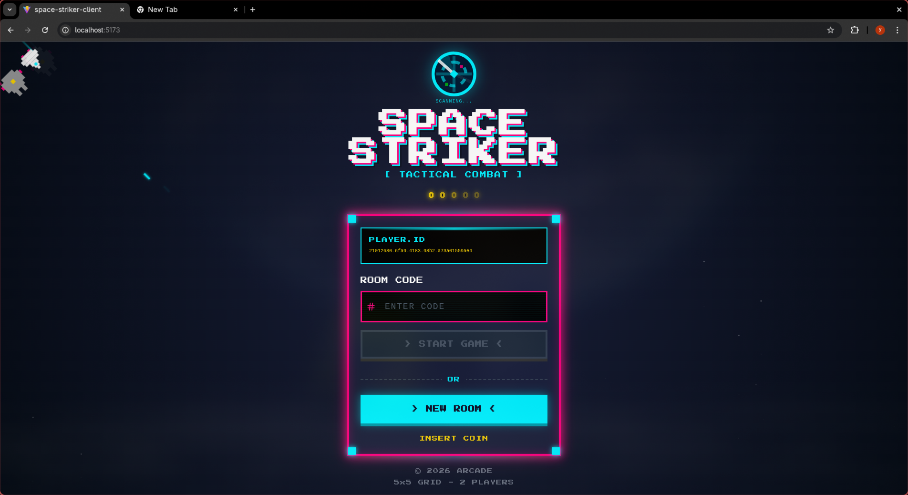
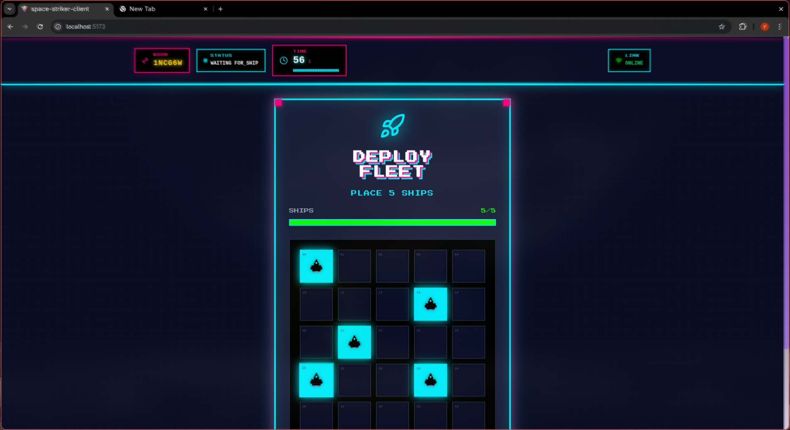
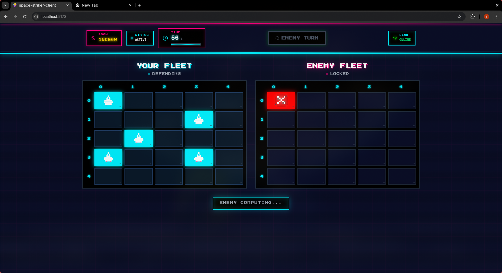
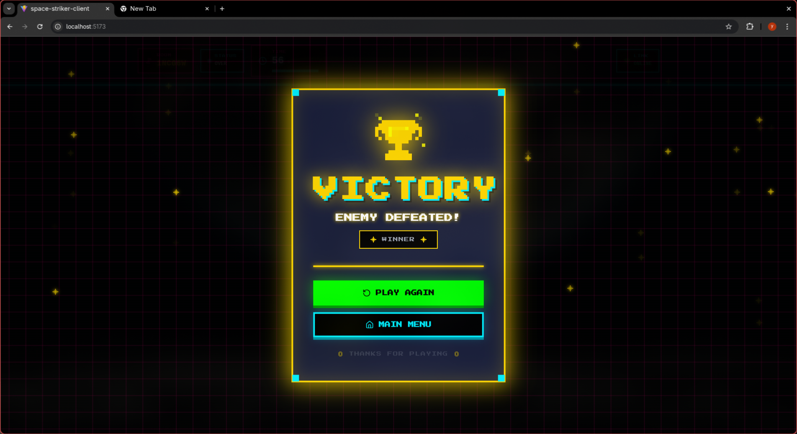

# Space Striker - Real-Time Multiplayer Strategy Game (Frontend)

<div align="center">
  <h3>🚀 A modern web-based Battleship-style tactical combat game with real-time multiplayer</h3>
  <p>Built with React, TypeScript, and WebSocket for instant player-to-player interaction</p>
</div>

---

## 📖 Overview

**Space Striker** is a real-time multiplayer tactical combat game where players compete in a 5x5 grid battlefield. This repository contains the **frontend client** - a modern, responsive web application that communicates with a Go-based WebSocket server to provide instant, synchronized gameplay between two players.

The game features a **retro arcade cabinet aesthetic** with pixel art SVG sprites, the "Press Start 2P" font, scanline effects, and neon glow styling — all powered by Framer Motion animations.

The game follows a Battleship-inspired mechanic where players:
1. **Place their fleet** of 5 ships strategically on their own board
2. **Take turns** striking at the opponent's board within a **30-second time limit** per turn
3. **Win** by destroying all enemy ships first

---

## 🔗 Related

- **Backend Repository** - [space-striker-server](https://github.com/Harish-Naruto/space-striker-server) (Go WebSocket server)

---

## 🎮 Game Mechanics

### Lobby System
- Players can **create a new room** (generates a 6-character room code)
- Players can **join an existing room** using a room code
- Each player has a persistent unique ID stored in localStorage
- Real-time connection status indicators

### Ship Placement Phase
- Players place **5 ships** on a 5x5 grid
- Ships are placed one cell at a time (click to toggle)
- Progress bar showing ships placed vs. required
- Reset (clear) and confirm buttons
- Confirmation system before starting the battle

### Battle Phase
- **Turn-based combat** with real-time updates
- **30-second countdown timer** per turn (with server-synced clock)
- Click on opponent's board to launch strikes
- Pixel art sprite-based visual indicators for:
  - **Hits** - Red explosion animation when a ship is struck
  - **Misses** - Blue splash sprite when striking empty water
  - **Ships** - Cyan ship sprite on your own board
  - **Crosshair** - Targeting crosshair on hover over enemy cells
- Active player indicator with turn status
- Both boards visible simultaneously (yours and opponent's)
- Toast notifications for connection events and errors

### Game Over
- Victory/defeat screen with animated pixel art sprites (trophy or skull)
- Options to play again or return to lobby

---

## 🏗️ Frontend Architecture

### Technology Stack

#### Core Technologies
- **React 19** - Modern UI library with latest features
- **TypeScript 5.9** - Type-safe development
- **Vite 7** - Lightning-fast build tool and dev server
- **SWC** - Super-fast TypeScript/JavaScript compiler

#### Styling & UI
- **Tailwind CSS 4** - Utility-first CSS framework
- **Framer Motion 12** - Smooth animations and transitions
- **Radix UI** - Accessible component primitives (via shadcn/ui)
- **shadcn/ui** - Pre-built component library (New York style)
- **Lucide React** - Beautiful icon library
- **CVA** (Class Variance Authority) - Component variant management
- **clsx** + **tailwind-merge** - Conditional class name utilities
- **tw-animate-css** - Animation utilities for Tailwind
- **react-toastify** - Toast notifications for game events
- **Press Start 2P** - Google Font for retro arcade aesthetic

#### State Management & Data
- **Zustand 5** - Lightweight state management
- **WebSocket API** - Real-time bidirectional communication
- **UUID** - Unique player identification

---

## 📁 Project Structure

```
src/
├── components/          # Reusable UI components
│   ├── Game/           # Game-specific components
│   │   ├── Board.tsx        # Game board grid with cell rendering
│   │   ├── CountDown.tsx    # Turn countdown timer (server-synced)
│   │   ├── HUD.tsx          # Heads-up display (room code, status, timer)
│   │   ├── Placement.tsx    # Ship placement interface
│   │   ├── GameOver.tsx     # End game screen (victory/defeat)
│   │   └── Spritesheet.tsx  # SVG pixel art sprite definitions & components
│   └── ui/             # Generic UI components (shadcn/ui)
│       └── button.tsx       # Button component with variants
│
├── views/              # Main application views
│   ├── Lobby.tsx                # Room creation/joining interface
│   ├── GameView.tsx             # Main game container
│   └── SpaceBattkeBackground.tsx # Animated space background with ships
│
├── store/              # State management
│   └── useGameStore.ts     # Zustand store for game state
│
├── hooks/              # Custom React hooks
│   └── useGameSocket.ts    # WebSocket connection management
│
├── types/              # TypeScript type definitions
│   └── game.ts            # Game state, messages, and types
│
├── utils/              # Utility functions
│   └── utils.ts           # Helper functions (room ID generation, cell styles)
│
├── lib/                # Library configurations
│   └── utils.ts           # Tailwind class merge utility (cn)
│
├── styles/             # CSS animations and effects
│   ├── galaxy-animations.css  # Scrollbar, reduced-motion, GPU helpers
│   └── game-animations.css    # Game-specific keyframe animations
│
├── assets/             # Static assets
│   └── react.svg          # React logo SVG
│
├── App.tsx             # Root application component
├── App.css             # App-level styles
├── main.tsx            # Application entry point
└── index.css           # Global Tailwind + shadcn/ui theme styles
```

---

## 🔄 Real-Time Communication (WebSocket)

### Connection Architecture

The frontend establishes a WebSocket connection to the backend server using the player's unique ID and room code:

```typescript
ws://localhost:8080/ws?roomID={ROOM_CODE}&playerID={PLAYER_ID}
```

### Message Types

**Client → Server:**
- `MOVE` - Strike a cell on opponent's board
- `PLACE_SHIP` - Submit ship placement coordinates

**Server → Client:**
- `GAME_STATE` - Full game state on connection/reconnection
- `GAME_UPDATE` - Game status change (e.g., phase transitions)
- `MOVE` - Result of a strike (hit/miss, next turn, timer)
- `GAME_OVER` - Winner announcement
- `TIME_OUT` - Turn timeout (auto-switches the active player)
- `SYNC_TIME` - Server clock synchronization for countdown timer
- `CHAT` - Chat messages (future feature)
- `ERROR` - Error messages from server

### Message Format
```typescript
interface MessageWs {
  type: MessageType;
  payload: any;  // Varies by message type
}
```

### Connection States
- **Disconnected** - No active connection
- **Connecting** - Establishing WebSocket connection
- **Connected** - Active real-time connection

The `useGameSocket` hook manages the entire WebSocket lifecycle and handles all message types.

---

## 🎨 State Management

### Zustand Store (`useGameStore`)

The application uses a centralized Zustand store for global state:

```typescript
interface GameStore {
  gameState: GameStateResponse | null;  // Current game state from server
  playerID: string;                     // Persistent unique player ID
  connectionStatus: ConnectionStatus;   // WebSocket connection status
  roomID: string | null;                // Current room code
  lastMove: HitPayload | null;          // Last move result
  serverOffset: number;                 // Clock offset for timer sync
  
  // Actions
  setGameState(state): void;
  updateConnectionStatus(status): void;
  setRoomID(roomID): void;
  setLastMove(move): void;
  applyMove(move): void;           // Apply a move to boards locally
  setGameStatus(status): void;     // Update game phase
  setTurn(nextTurn, endAt): void;  // Switch active player & reset timer
  resetGame(): void;
  gameOver(winnerId): void;        // Set winner and OVER status
  setServerOffset(serverTime): void; // Sync local clock with server
}
```

### Game State Structure

```typescript
interface GameStateResponse {
  id: string;                    // Game session ID
  yourBoard: number[][];         // Your 5x5 board (shows your ships)
  opponentBoard: number[][];     // Opponent's 5x5 board (ships hidden)
  activePlayer: string;          // Player ID whose turn it is
  winner: string;                // Player ID of winner (if game finished)
  status: GameStatus;            // Current game phase
  endAt: number;                 // Turn deadline timestamp (unix ms)
}
```

### Cell States
- `0` - Empty water
- `1` - Ship (only visible on your board)
- `2` - Hit (ship was struck)
- `3` - Miss (struck empty water)

---
## 📸 Screenshots

### Setup & Gameplay
| Lobby | Ship Placement | Gameplay |
|:---:|:---:|:---:|
|  |  |  |

### Game Outcomes
| Victory | Game Over |
|:---:|:---:|
|  |  |

---
## 🚀 Getting Started

### Prerequisites
- Node.js 18+ or Bun runtime
- Backend server running (see backend repository)

### Installation

```bash
# Clone the repository
git clone https://github.com/Harish-Naruto/space-striker-client.git
cd space-striker-client

bun install
```

### Environment Setup

Copy the example environment file and adjust values as needed:

```bash
cp .env.example .env
```

The `.env.example` file contains:
```
WEBSOCKET_URL='ws://localhost:8080/ws'
HTTP_URL='http://localhost:8080'
```

### Development

```bash
bun run dev
```

The application will start at `http://localhost:5173` (default Vite port).

**Note:** Ensure the backend WebSocket server is running at `ws://localhost:8080/ws` before starting the frontend.

### Linting

```bash
bun run lint
```

### Build for Production

```bash
bun run build
```

### Preview Production Build

```bash
bun run preview
```

---

## 🔧 Configuration

### WebSocket URL
The WebSocket connection URL is currently hardcoded in `src/hooks/useGameSocket.ts`:

```typescript
const WEBSOCKET_URL = 'ws://localhost:8080/ws';
```

Update this to point to your backend server in production. A `.env.example` file is provided for reference, but the environment variables are not yet wired into the application code.

### Path Aliases
The project uses `@/` as a path alias for the `src/` directory, configured in both `vite.config.ts` and `tsconfig.app.json`.

### Tailwind CSS
Tailwind v4 configuration is managed through `@tailwindcss/vite` plugin, with theme styles in `src/index.css`. The project uses shadcn/ui (New York style) for component primitives.

### TypeScript
- `tsconfig.json` - Base TypeScript configuration
- `tsconfig.app.json` - Application-specific config
- `tsconfig.node.json` - Node.js/Vite config

---

## 🎯 Key Features

✅ **Real-time multiplayer** - Instant updates via WebSocket  
✅ **Turn timer** - 30-second countdown with server-synced clock  
✅ **Retro arcade aesthetic** - Pixel art sprites, scanlines, neon glow, "Press Start 2P" font  
✅ **Smooth animations** - Framer Motion powered transitions and sprite animations  
✅ **Type-safe** - Full TypeScript coverage  
✅ **Modern UI** - Tailwind CSS with custom animations  
✅ **Persistent player ID** - No signup required  
✅ **Room-based matchmaking** - Easy join with 6-character room codes  
✅ **Visual feedback** - Sprite-based indicators for hits, misses, and ships  
✅ **Toast notifications** - Real-time connection and error feedback  
✅ **Accessible motion** - Respects `prefers-reduced-motion` user preference  

---

## 🔮 Future Enhancements

- 🗨️ In-game chat system
- 📊 Game statistics and leaderboards
- 🎵 Sound effects and background music
- 🌐 Multiple room lobbies
- 🏆 Ranking system
- 🎨 Customizable themes
- 📱 Progressive Web App (PWA) support
- 🔄 Reconnection handling for disconnected players

---

## 🤝 Contributing

Contributions are welcome! Please feel free to submit a Pull Request.

---

## 📄 License

This project is open source and available under the MIT License.

---

<div align="center">
  Made with ❤️ using React + TypeScript + Vite
</div>
